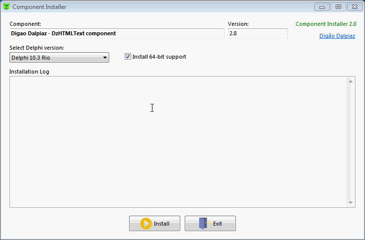

# Component Installer

## Delphi VCL app utility to auto-install component packages into IDE.

[](https://ko-fi.com/C0C53LVFN)

- [What's New](#whats-new)
- [Description](#description)
- [Features](#features)
- [How to use](#how-to-use)
- [CompInstall.ini structure](#compinstallini-structure)

## What's New

- 01/24/2024 (Version 2.6)

  - Delphi 12 support.
  - New ini properties: OutputPath and Package\Path
  - PublishFiles now supports sub-folder.
  - Clear all files and sub-folders when updating from GitHub.

<details>
  <summary>Click here to view the entire changelog</summary>

- 09/12/2021 (Version 2.5)

   - Delphi 11 support.

- 03/25/2021 (Version 2.4)

   - As it is not a good practice to embed the Component Installer EXE in the GitHub component sources, the update of the GitHub repository has been modified to not update the Component Installer EXE, but only the configured component sources.
   - Removed backup functionality in GitHub auto-update.

- 02/01/2021 (Version 2.3)

   - Fixed sub-folders creation (missing) when extracting files on GitHub update.
   - New backup folder on GitHub update (actual folder will be renamed using date and time sufix).

- 12/18/2020 (Version 2.2)

   - Fixed call to rsvars.bat when Delphi is installed in a path containing spaces characters.

- 10/31/2020 (Version 2.1)

   - Included Delphi 10.4 Sydney support.
   - Implemented verification of the 64-bit Delphi compiler existence when the 64-bit flag was set.

- 10/26/2020 (Version 2.0)

   - Compilation process now uses thread.
   - GitHub auto-update supporting.

- 05/03/2020 (Version 1.2)

   - Fixed RegisterBPL method because Delphi XE5 or below use "RAD Studio" public folder instead "Embarcadero\Studio".

- 02/15/2019 (Version 1.1)

   - Removed Allow64bit parameter in the General section. The app will detect this parameter automatically when appears at any package parameter.
   
</details>

## Description

This app allows you to distribute your Delphi component without having to do a long task list to manually install the component into IDE (*when you are providing component sources, of course*).

In addition, if the component is hosted on GitHub, you can indicate the path of the repository and the application will check for updates directly in the repository's Releases.

## Features

- Detects all Delphi versions installed and allows programmer to choose which IDE to install.
- Compiles packages generating BPL files.
- Installs packages into IDE.
- Registers paths into Library Path.
- Copies required resource files to compiled folder (.dfm, .res, ...).
- Updates component hosted at GitHub automatically.
- Supports 32 bits and 64 bits compilation.

## How to use

You need only to create an Ini file called **CompInstall.ini** and write parameters to the app.

Then put the **CompInstall.exe** and **CompInstall.ini** into your component package directory and be happy. :wink:

> Note: This app requires MSBUILD, which is present at .NET Framework 2.0, 3.5 and 4.0. When the app launch, it will verify if any MSBUILD is available.

## CompInstall.ini structure

**`[General]` section**

`Name` (required) = Component name displayed at install form and registered into Delphi Packages.

`Version` (required) = Component version displayed at install form and used by GitHub auto-update control (if enabled).

`DelphiVersions` (required) = It's a list splitted by ";" with all Delphi versions supported by the component. According to Delphi versions installed in Windows and combining with this parameter, a combobox in the install form will list all possible Delphi versions.

> Supported values: 2005;2006;2007;2009;2010;XE;XE2;XE3;XE4;XE5;XE6;XE7;XE8;10;10.1;10.2;10.3;10.4;11;12

`Packages` (required) = It's a list splitted by ";" with packages to be compiled, in correct order. Just type the package name without the file extension.

`AddLibrary` (optional) = 0 or 1. When 1, the path of release folders of component will be registered into Delphi library path.

`OutputPath` (optional) = Relative folder where compiled files are stored (must be the same configured in package settings). You can use `{PLATFORM}` and `{CONFIG}` variables. Default value is: `{PLATFORM}\{CONFIG}` (By now, {CONFIG} is always "Release").

**Package section**

To specify package parameters, create a section with the name of the package with the `P_` prefix, like:

`[P_MyPackage]`

`Path` (optional) = Relative folder where package file is. If blank, package must be at component root folder.

`Allow64bit` (optional) = 0 or 1. When 1, specify this package to be compiled twice, with 32-bit and 64-bit versions. Remember to create this platform at Delphi Project Manager, otherwise the 64-bit compilation will fail.

If any package has this option enabled, it will be display a checkbox allowing install 64-bit version of component (the checkbox starts checked by default).

`PublishFiles` (optional) = It's a list splitted by ";" with all files you want to copy into release folders (usually DFM form files used at runtime and resource files).

`Install` (optional) = 0 or 1. When 1, this package will be installed into Delphi IDE. You need to set this option for design-time packages when you want to register components into Delphi IDE.

>Note: The app compiles your component using **Release** target. This means all packages need to be configured at default output folder (Win32\Release and Win64\Release).

**GitHub section**

`Repository` (optional) = Allows you to specify a GitHub repository (syntax: `GitHub account`/`Repository name`), so when app starts, it will check for component update using GitHub API, reading the latest existing release and comparing its version with current version. If the versions don't match, a dialog will be displayed asking if you want to auto-update files.

### Example

In this example, there are two Delphi packages (DamPackage and DamDesignPackage). The design-time package (DamDesignPackage) is configured to install into Delphi IDE. The runtime package (DamPackage) is configured to copy dfm form file and resource file to release folder.

```
[General]
Name=Dam Component
Version=1.0
DelphiVersions=XE2;XE3;XE4;XE5;XE6;XE7;XE8;10;10.1;10.2;10.3;10.4
Packages=DamPackage;DamDesignPackage
AddLibrary=1

[P_DamPackage]
Allow64bit=1
PublishFiles=DamDialog.dfm;Dam_Resource.res

[P_DamDesignPackage]
Install=1
```

**Check my Delphi components here at GitHub and find CompInstall.ini file to see others usage examples.**
